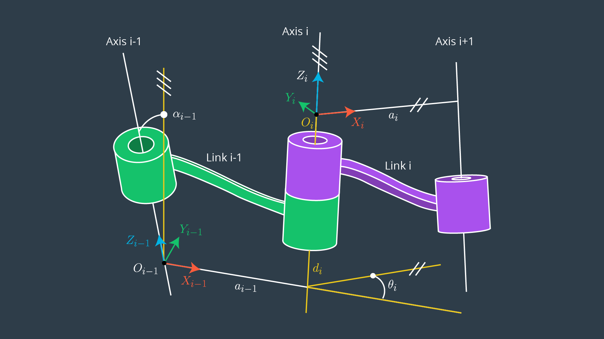
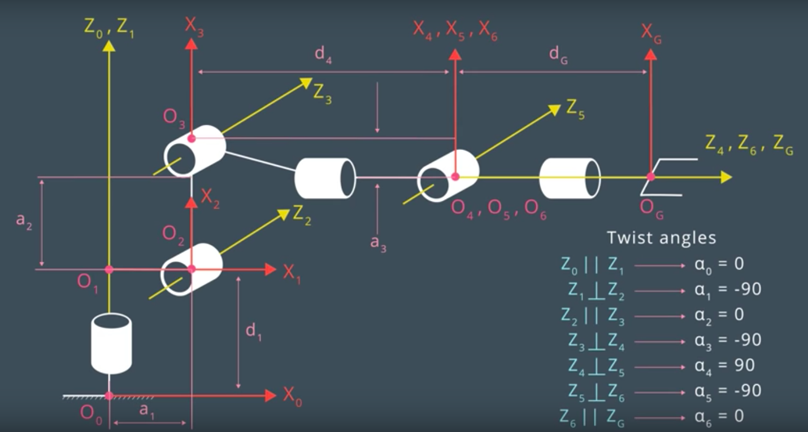
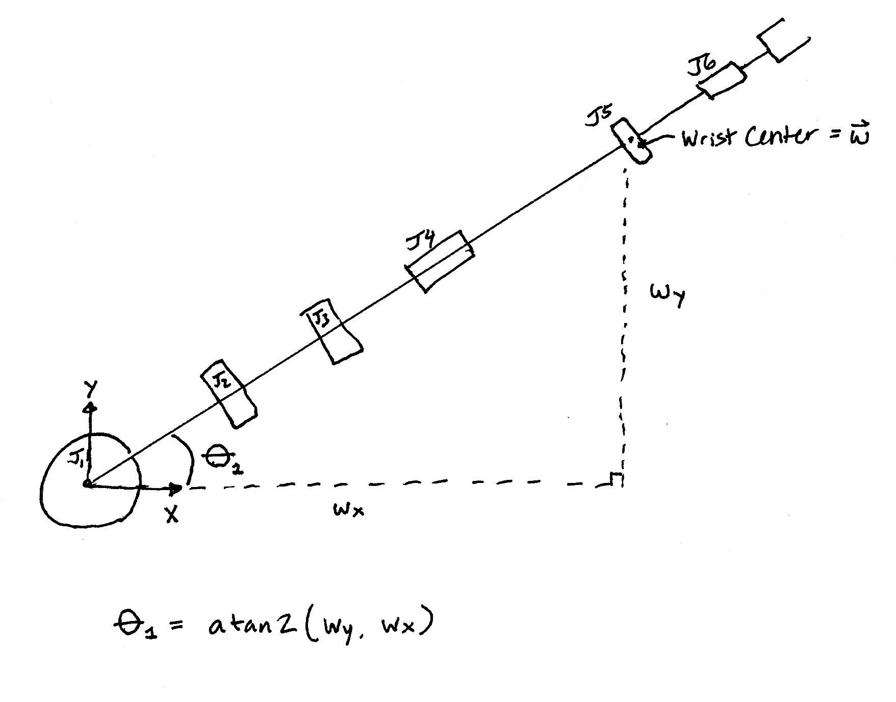
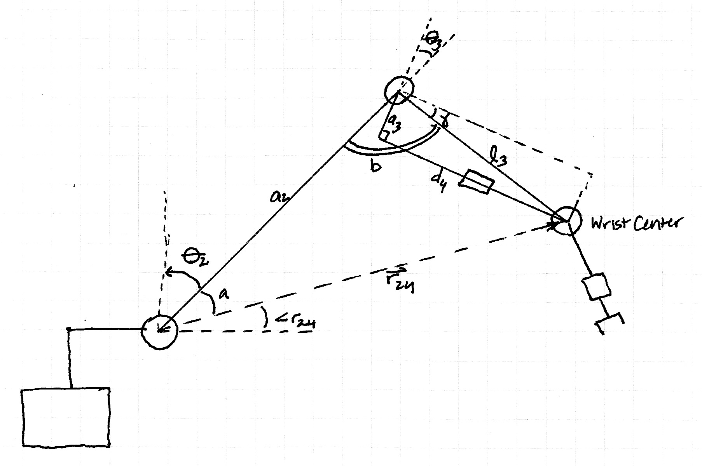
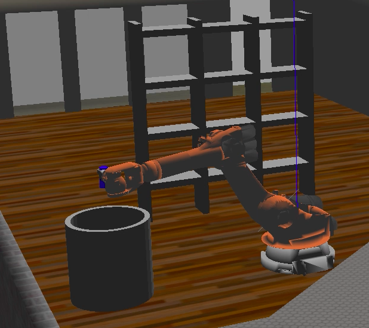
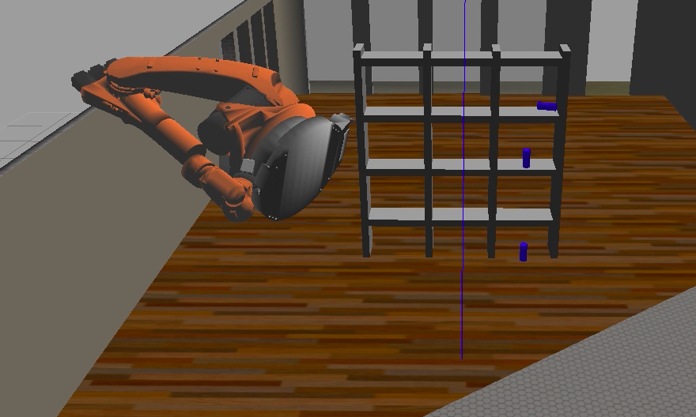

[//]: # (Image References)
[DH_parameters]: ./misc_images/DH_parameters_definition.png
[UDRF_frames]: ./misc_images/UDRF_file_frames.png
[KR210_DH_params]: ./misc_images/KR210_DH_params.png
[Theta1]: ...

## Project: Kinematics Pick & Place

### Kinematic Analysis
#### 1. Determine the DH Parameters

The content of the URDF file shows the following:

Link | Position (x,y,z) in m | Joint Axis | Frame Rotation (rpy) | Min Rotation (deg) | Max Rotation (deg)
:---:|:---:|:---:|:---:|:---:|:---:
Base | (0, 0, 0) | (0, 0, 0) | (0, 0, 0) | N/A | N/A
1 | (0, 0, 0.33) | (0, 0, 1) | (0, 0, 0) | -185 | 185
2 | (0.35, 0, 0.42) | (0, 1, 0) | (0, 0, 0) | -45 | 85
3 | (0, 0, 1.25) | (0, 1, 0) | (0, 0, 0) | -210 | 65
4 | (0.96, 0, -0.54) | (1, 0, 0) | (0, 0, 0) | -350 | 350
5 | (0.54, 0, 0) | (0, 1, 0) | (0, 0, 0) | -125 | 125
6 | (0.193, 0, 0) | (1, 0, 0) | (0, 0, 0) | -350 | 350
7 (Gripper) | (0.0375, 0, 0) | N/A | (0, 0, 0) | N/A | N/A

Where positions are with respect to the preceding link in the preceding link's coordinate frame.

To derive the modified DH parameters, I used definitions as shown in the image below:
</img>

Where:
 * &alpha;<sub>i−1</sub>  (twist angle) = angle between Z<sub>i-1</sub> and Z<sub>i</sub> measured about X<sub>i-1</sub>in a right-hand sense
 * a<sub>i-1</sub> (link length) = distance from Z<sub>i-1</sub> to Z<sub>i</sub> measured along X<sub>i-1</sub> where X<sub>i-1</sub> is perpendicular to both Z<sub>i-1</sub> and Z<sub>i</sub>
 * d<sub>i</sub> (link offset) = signed distance from X<sub>i</sub> measured along Z<sub>i</sub>
 * &theta;<sub>i</sub> (joint angle) = angle between X<sub>i-1</sub> and X<sub>i</sub> measured about Z<sub>i</sub> in a right-hand sense

For the Kuka KR210, the DH parameter layout looks as follows:
</img>

i | a<sub>i-1</sub> (m) | &alpha;<sub>i-1</sub> (deg) | d<sub>i</sub> (m) | &theta;<sub>i</sub> (deg)
:---:|:---:|:---:|:---:|:---:
1 | 0 | 0 | 0.75 | &theta;<sub>i</sub>
2 | 0.35 | -90 | 0 | &theta;<sub>2</sub>-90
3 | 1.25 | 0 | 0 | &theta;<sub>3</sub>
4 | -0.054 | -90 | 1.5 | &theta;<sub>4</sub>
5 | 0 | 90 | 0 | &theta;<sub>5</sub>
6 | 0 | -90 | 0 | &theta;<sub>6</sub>
7 (gripper) | 0 | 0 | 0.303 | 0

#### 2. Create Individual Coordinate Frame Transforms

Using the DH parameter table above, I generated transformation matrices from joint i-1 to i using the following relationship defined within the method `_body_fixed_transformation()`:

```python
transform = Matrix([[            cos(theta),           -sin(theta),            0,              a],
                    [ sin(theta)*cos(alpha), cos(theta)*cos(alpha),  -sin(alpha),  -sin(alpha)*d],
                    [ sin(theta)*sin(alpha), cos(theta)*sin(alpha),   cos(alpha),   cos(alpha)*d],
                    [                     0,                     0,            0,              1]])
```

Where:
 * `theta` = &theta;<sub>i</sub>
 *  `alpha` = &alpha;<sub>i-1</sub>
 * `a` = a<sub>i-1</sub>
 * `d` = d<sub>i</sub>

To build the higher level transformations, I used the method `build_transformations()` as defined below:

```python
def _buildTransforms(self, s):
    T = {}
    for i in range(1,8):
        T[(i-1,i)] = self._body_fixed_transformation(s, i)
        if i>1:
            T[(0,i)] = T[(0,i-1)]*T[(i-1,i)]

    T[(3,6)] = T[(3,4)]*T[(4,5)]*T[(5,6)]

    return T
```

In addition to the joint-to-joint transformations, I also defined methods to calculate the intrinsic rotation matrix given the axis of rotation and angle of rotation (in degrees) as follows:

```python
def _rot(self, axis, q):
    '''
    Return rotation matrix about specified axis
    given rotation angle q (in radians).
    '''

    q *= pi/180.

    if axis == 'X':
        R = [[ 1,      0,       0],
             [ 0, cos(q), -sin(q)],
             [ 0, sin(q),  cos(q)]]
    elif axis == 'Y':
        R = [[  cos(q), 0, sin(q)],
             [       0, 1,      0],
             [ -sin(q), 0, cos(q)]]
    elif axis == 'Z':
        R = [[ cos(q), -sin(q), 0],
             [ sin(q),  cos(q), 0],
             [      0,       0, 1]]
    else:
        raise RuntimeError('{} is not a valid axis. Options are "X", "Y", or "Z".'.format(axis))

    return Matrix(R)
```

This method is needed to calcuate R<sub>corr</sub>, which accounts for the misalignment between the gripper frame in the URDF file and the frame used in the contruction of the DH parameters:

```python
#rotate 180 degrees about z, then -90 degrees about y
self.R_corr = self._rot('Z',180)*self._rot('Y',-90)
```

#### 3. Calculate Joint Angles from End Effector Position and Orientation

The inverse kinematics problem is broken into two sub-problems: finding the wrist center and finding the orientation of the wrist.

For each inverse kinematics calculation iteration, ROS feeds the IK server the end effector (gripper) position (P) and orientation (q) wrt the base frame.

I converted the quaternion to a rotation matrix (R<sub>rpy</sub>) using the `quaternion_matrix()` function from the tf module in my `_return_Rrpy()` method as follows:

```python
def _returnRrpy(self, quaternion):
    #EE rotation matrix
    Trpy = tf.transformations.quaternion_matrix(quaternion)
    Rrpy = Matrix(Trpy[:3,:3])

    #apply correction to orientation to account for 
    #different coord definitions in udrf versus DH params
    Rrpy = Rrpy*self.R_corr

    return Rrpy
```

##### Finding the Wrist Center

To find the wrist center, subtracted d<sub>7</sub> (the length from the wrist center to the end effector center) along the end effector axis:
 WC = P - d<sub>7</sub>R<sub>rpy</sub>[:3,3]
 
 In code:
 ```python
 def _returnWristCenter(self, consts, ee_target, Rrpy):
    #wrist center wc = [[wx], [wy], [wz]] in base coords
    wc_target = ee_target - Rrpy*Matrix([0,0,consts['d7']])
    wc_target = wc_target.evalf()

    return wc_target
 ```

##### Finding &theta;<sub>1</sub>:

  &theta;<sub>1</sub> = atan2(WC<sub>y</sub>, WC<sub>x</sub>)

  </img>

##### Finding &theta;<sub>2</sub> and &theta;<sub>3</sub>:

  To calculate &theta;<sub>2</sub> and &theta;<sub>3</sub>, I used the law of cosines combined with the construction shown below.

  </img>

  The construction shows:
   * Sides:
    * link 2 (length a<sub>2</sub>)
    * r<sub>24</sub>, a vector from the joint 2 frame to the joint 4 frame
    * link 3 (as drawn directly from link 3 frame to the link 4 frame)
   * Angles:
    * a, the angle between r<sub>24</sub> and link 2
    * b, the angle between link 2 and link 3
    * angle r<sub>24</sub>, the angle from the xy plane (base link) to r<sub>24</sub>
    * &gamma;, the angle between the joint 2 Y axis and link 3 (angle of declination of link 3)

  The following relationships are used to simplify the equations for calculating &theta;<sub>2</sub> and &theta;<sub>3</sub>:
   * l<sub>3</sub> = (d<sub>4</sub><sup>2</sup> + a<sub>3</sub><sup>2</sup>)<sup>0.5</sup>
   * angle r<sub>24</sub> = atan2(r<sub>24,z</sub>, r<sub>24,xy</sub>
   * \|r<sub>24</sub>\| = (r<sub>24,z</sub><sup>2</sup> + r<sub>24,xy</sub><sup>2</sup>)<sup>0.5</sup>)
   * &gamma; = atan2(-a<sub>3</sub>, d<sub>4</sub>)
  
  From the law of cosines, we can see that:
   * l<sub>3</sub><sup>2</sup> = a<sub>2</sub><sup>2</sup> + \|r<sub>24</sub>\| - 2a<sub>2</sub>\|r<sub>24</sub>\|cos(a)
   * \|r<sub>24</sub>\|<sup>2</sup> = a<sub>2</sub><sup>2</sup> + l<sub>3</sub><sup>2</sup> - 2a<sub>2</sub>l<sub>3</sub>cos(b)
   
  To find &theta;<sub>2</sub> and &theta;<sub>3</sub>, simply solve these relationships for angles a and b and note that:
   * &theta;<sub>2</sub> = &pi;/2 - a - angle r<sub>24</sub>
   * &theta;<sub>3</sub> = &pi;/2 - &gamma; - b
   
  Note: The relationship for &#952;<sub>2</sub> is only true when r<sub>24</sub> falls below link 2 in the construction. Otherwise, the relationship would be &#952;<sub>2</sub> = pi/2 + a - angle r<sub>24</sub>. Though it would be possible to check for this, I chose to just calculate &#952;<sub>2</sub> using the expression above since the range of travel of the robotic arm in the simulation should obey this constraint.

##### Finding &theta;<sub>4</sub>, &theta;<sub>5</sub>, and &theta;<sub>6</sub>:
  To calculate &theta;<sub>4</sub>, &theta;<sub>5</sub>, and &theta;<sub>6</sub>, I used the following relationship:
   R<sub>36</sub> = R<sub>03</sub><sup>T</sup>R<sub>06</sub>
  
  Furthermore, since R<sub>06</sub> is equivalent to R<sub>rpy</sub>, for each iteration, R<sub>36</sub> can be calculated numerically using:
   R<sub>36</sub> = R<sub>03</sub><sup>T</sup>R<sub>rpy</sub>
   
  By examining the symbolic output of R<sub>36</sub> from sympy, I extracted the following relationships (for clarity, let R = R<sub>36</sub>):
   * &theta;<sub>4</sub> = atan2(R<sub>33</sub>, -R<sub>13</sub>)
   * &theta;<sub>5</sub> = atan2((R<sub>13</sub><sup>2</sup> + R<sub>33</sub><sup>2</sup>)<sup>0.5</sup>, R<sub>23</sub>)
   * &theta;<sub>6</sub> = atan2(-R<sub>22</sub>, R<sub>21</sub>)
   
  In code:
  ```python
  def _returnTheta456(self, theta1, theta2, theta3, Rrpy):
    '''
    Calculate theta 4, theta5, theta6 based on relations
    between elements in the rotation matrix from frame 3 to 6.
    Uses knowledge that Rrpy should be equal to R_06.
    '''
    R_03 = self.T[(0,3)][:3,:3].evalf(subs = {self.q1: theta1,
                                              self.q2: theta2,
                                              self.q3: theta3})

    R_36 = R_03.T*Rrpy

    theta4 = atan2(R_36[2,2], -R_36[0,2])
    theta5 = atan2((R_36[0,2]**2 + R_36[2,2]**2)**0.5, R_36[1,2])#acos(R_36[1,2])#
    theta6 = atan2(-R_36[1,1], R_36[1,0])

    return [theta4, theta5, theta6]
  ```

### Project Implementation

#### 1. `IK_Server.py` Implementation

My goals in implementing IK_Server.py (beyond making a working implementation) were to keep things simple, fast, and easily testable.

##### Testability and Simplicity
In order to accomplish these, I broke out most of the functionality required for the IK server into a separate importable module, `IK.py`. Within `IK.py`, I imported the necessary modules and implemented a single class called Kuka_IK. I also made IK_Server into a self-contained class to aid in the initialization of Kuka_IK() within IK_Server.

Using this method, I was able to directly call the overall inverse kinematics method as well as methods for solving individual portions of the inverse kinematics problem, which was helpful for debugging.

##### Speed
I noticed the code template provided as a starting point for this project was quite bogged down from the following operations:
  1. Initializing sympy transformation matrices
  2. Simplifying symbolic sympy expressions
  3. Substituting numerical values into symbolic sympy matrices
  4. Multiplying sympy matrices together
 
I tried to optimized the program's performance by avoiding these operations as much as possible. In refactoring the IK code, I chose to:
  1. Initialize the sympy matrices once instead of every iteration
  2. Completely eliminate calls to sympy's simplify() function
  3. Avoid matrix multiplication in inverse kinematics evaluation where possible
  
Using these approaches, I was able to get individual inverse kinematics calculations down to ~0.1 seconds.

##### Success!
Click through below for a video of one of the successful runs (6X speed)
[](https://youtu.be/j2d7W9LQCgI "Successful Grasp")
  
##### Possible Improvements
The speed of the inverse kinematics could definitely be improved by replacing all sympy matrices with lambda functions that return numpy matrices when passed numerical values for variables. Luckily, sympy includes a function for this called lambdify().

If I were concerned about operating the arm in a larger portion of the robot configuration space, then more general approaches to the inverse kinematics would be required. For example, my method for calculation of &#952;<sub>2</sub> is only valid within a relatively narrow set of joint positions (as noted in section 3). A simple way around this issue would be to consider IK solutions for various combinations of joint angles and use each possible answer for each joint to calculate a forward kinematics solution for the wrist center. Based on the prediction of the wrist center, the combinations of solutions for each joint that yields the best predicted joint error could be used.

I also came across a bug indicative instabilities in the Gazebo environment that I was lucky enough to capture on video. Seems like this might be something to fix in future iterations (click through for video):
[](https://youtu.be/BkZPh5znE5E "Arm Blowing Up")


